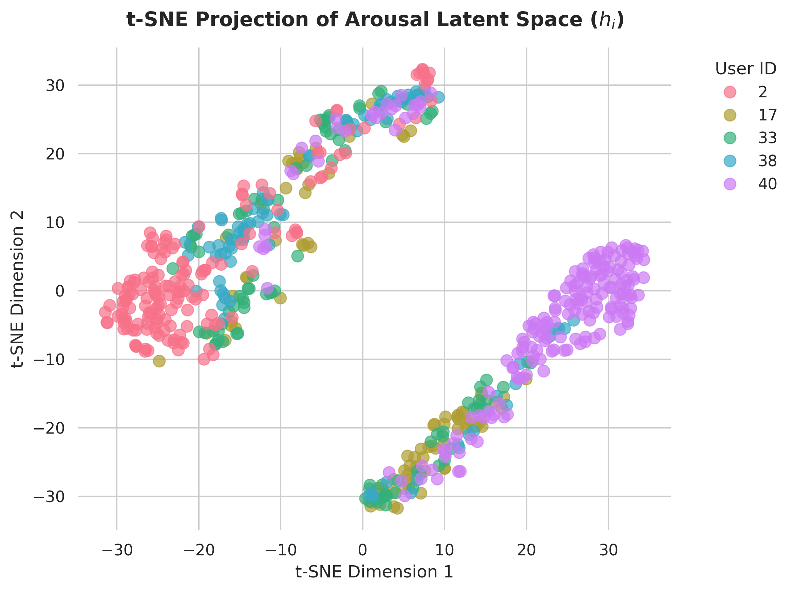
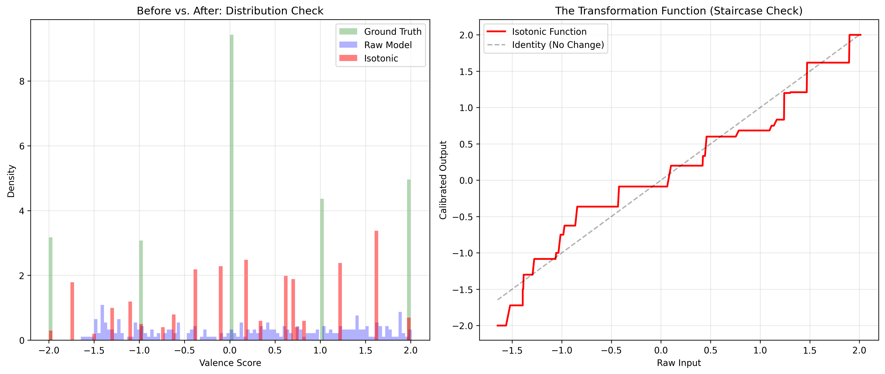

# LexMachina at SemEval-2026 Task 2 🧠📝
**Predicting Variation in Emotional Valence and Arousal over Time from Ecological Essays**

[](https://www.python.org/downloads/)
[](https://pytorch.org/)
[](https://huggingface.co/docs/transformers/index)

This repository contains the official code, models, and analytical plots for the **LexMachina** system, submitted to **SemEval-2026 Task 2: Longitudinal Affect Assessment (Subtask 1)** by the team from Jadavpur University. 

Our system achieved competitive composite correlation scores of **$r = 0.645$ for Valence** and **$r = 0.434$ for Arousal** by utilizing a bifurcated optimization strategy to handle domain shift and conservative prediction biases.

---

## 🏗️ System Architecture


Our dual-stream architecture leverages **DeBERTa-v3-base** as the core linguistic feature extractor, followed by two distinct pipelines tailored to the unique challenges of Valence and Arousal prediction:

1. **Arousal Stream (Domain-Adversarial Neural Network - DANN):**
   To solve the "User Generalization Gap" (where models overfit to seen users and fail on strangers), we implemented a DANN. A Gradient Reversal Layer (GRL) forces the model to learn *user-invariant* affective representations, significantly boosting zero-shot performance on unseen users.
2. **Valence Stream (Isotonic Calibration):**
   To counteract the "regression to the mean" phenomenon inherent in standard MSE-optimized regression heads, we applied Post-Hoc Isotonic Calibration to stretch predictions back to the extreme boundaries of the $[-2, 2]$ space.
3. **Out-of-Fold (OOF) Data Sanitation:**
   An automated 3-fold cross-validation pipeline purges approximately 9% of the training data containing severe label noise/semantic inversions prior to final model training.

---

## 📊 Official Results

Our system was evaluated using the official SemEval composite correlation metric ($r_c$), which aggregates inter-user traits ($r_b$) and temporal fluctuations ($r_w$).

| Evaluation Slice | Valence ($r_c$) | Valence ($r_b$) | Valence ($r_w$) | Arousal ($r_c$) | Arousal ($r_b$) | Arousal ($r_w$) |
| :--- | :---: | :---: | :---: | :---: | :---: | :---: |
| **Overall System** | **0.645** | **0.712** | **0.567** | **0.434** | **0.461** | **0.406** |
| Seen Users | 0.636 | 0.718 | 0.537 | 0.343 | 0.323 | 0.363 |
| Unseen Users | 0.669 | 0.734 | 0.593 | **0.574** | **0.681** | **0.443** |
| Words Only | 0.655 | 0.730 | 0.563 | 0.572 | 0.631 | 0.507 |
| Essay Only | 0.627 | 0.665 | 0.586 | 0.307 | 0.315 | 0.298 |

---

## 🔬 Visualizing the Framework

### 1. DANN Latent Space (t-SNE)
By disabling the user identity markers during training, our Gradient Reversal Layer successfully forced the network to learn a user-agnostic affective space. Below, the highly overlapping clusters of the top 5 users prove the effectiveness of the adversarial disentanglement:



### 2. Isotonic Calibration Artifacts
While Isotonic Regression successfully cured the conservative bias in our Valence stream, our error analysis revealed a "staircase effect" (quantization artifacts) as the continuous variable was mapped to the validation set's step-function distribution:



---

## 📂 Repository Structure

* `clean-semeval-final.ipynb`: The primary Jupyter Notebook containing the entire pipeline end-to-end. This includes:
  * OOF Data Sanitation Protocol.
  * Model class definitions (DANN and Vanilla regressors).
  * Training loops with dynamic GRL scheduling.
  * 3-Seed Ensemble generation.
  * Latent space extraction and plotting.
* `architecture_diagram.png`: Visual representation of our dual-stream system.
* `tsne_plot.png`: t-SNE projection of the DANN embeddings.
* `valence_forensic_analysis.png`: Error analysis of the Valence predictions.

---

## 🚀 Getting Started

### Prerequisites
Ensure you have Python 3.10+ installed. The required libraries can be installed via:

```bash
pip install torch transformers pandas numpy scikit-learn matplotlib seaborn tqdm
Running the Code
The entire workflow is encapsulated within the clean-semeval-final.ipynb notebook. It is optimized to run on a standard GPU (e.g., NVIDIA Tesla T4 or equivalent).

Clone this repository:

Bash
git clone [https://github.com/YOUR_USERNAME/YOUR_REPOSITORY_NAME.git](https://github.com/YOUR_USERNAME/YOUR_REPOSITORY_NAME.git)
cd YOUR_REPOSITORY_NAME
Place the official SemEval training and test CSV datasets into the root directory.

Run the Jupyter Notebook sequentially. The notebook will automatically clean the data, train the models across 3 random seeds, generate the final ensemble predictions, and plot the analytical charts.

📝 Citation
If you use our code, our Out-of-Fold sanitation protocol, or build upon our Instance-Weighted Domain Adaptation theories, please cite our SemEval-2026 paper:

Code snippet
@inproceedings{lexmachina2026semeval,
    title={LexMachina at SemEval-2026 Task 2: Predicting Variation in Emotional Valence and Arousal over Time from Ecological Essays},
    author={Ganguli, Somdev and Dutta, Vibhan and Datta, Romit and Barman, Amit and Naskar, Sudip Kr},
    booktitle={Proceedings of the 20th International Workshop on Semantic Evaluation (SemEval-2026)},
    year={2026},
    publisher={Association for Computational Linguistics}
}

*(Just remember to change `YOUR_USERNAME/YOUR_REPOSITORY_NAME` in the clone command to your actual GitHub link!)*
