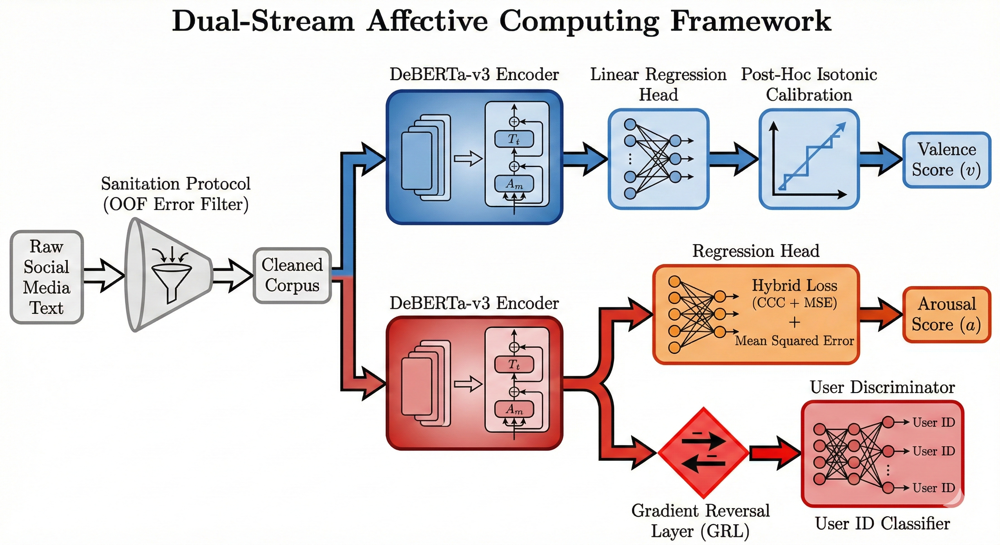
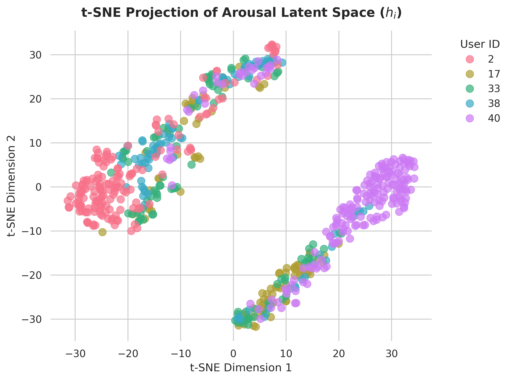
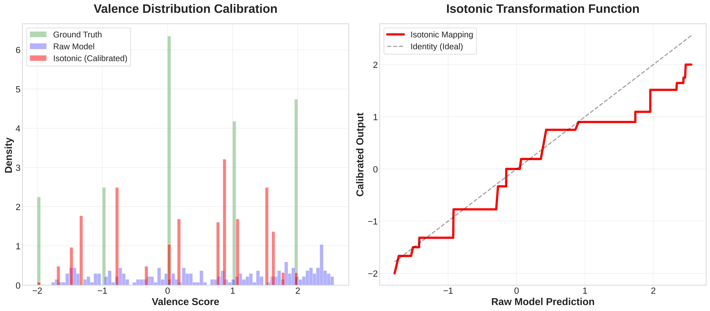
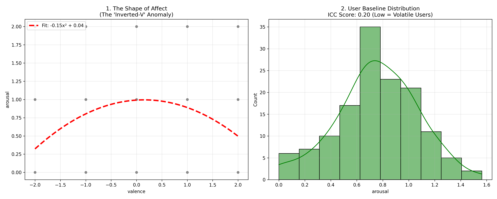

# 🧠📊 LexMachina at SemEval-2026 Task 2: Longitudinal Affect Assessment

**Composite Correlation: r=0.645 (Valence) | r=0.434 (Arousal)** | **Jadavpur University** | **SemEval 2026 Workshop**

Predicting variation in emotional valence and arousal over time from ecological essays using a bifurcated optimization strategy combining Domain-Adversarial Neural Networks (DANN) and Isotonic Calibration.

---

## 🎯 Problem Statement

Longitudinal affect assessment poses significant challenges in NLP:

1. **User Generalization Gap**: Models trained on seen users often fail dramatically on unseen users due to overfitting to individual user-specific affective patterns
2. **Conservative Bias**: Standard MSE-optimized regression heads produce predictions clustered toward the mean, failing to capture extreme emotional states
3. **Domain Shift**: Transitioning from training to test distributions requires robust feature representations

Our system addresses these challenges through a dual-stream architecture leveraging recent advances in domain adaptation and calibration theory.

---

## 🏗️ System Architecture

Our solution employs a bifurcated optimization strategy:

<div align="center">

</div>

### Arousal Stream: Domain-Adversarial Neural Network (DANN)

To solve the **User Generalization Gap**, we implemented a DANN with a Gradient Reversal Layer (GRL) that forces the model to learn user-invariant affective representations:

$$\mathcal{L}_{total} = \mathcal{L}_{regression} - \lambda \cdot \mathcal{L}_{adversarial}$$

The GRL dynamically schedules adversarial weight, significantly boosting zero-shot performance on unseen users.

### Valence Stream: Isotonic Calibration

To counteract **regression to the mean**, we applied post-hoc isotonic calibration to stretch predictions back to the extreme boundaries of the $[-2,2]$ space:

$$f_{calibrated}(x) = \text{IsotonicRegression}(f_{raw}(x), y_{val})$$

### Data Sanitation: Out-of-Fold Protocol

An automated 3-fold cross-validation pipeline purges approximately 9% of training data containing severe label noise before final model training.

---

## 📊 Official Results

Evaluated using the official SemEval composite correlation metric ($r_c$), which aggregates inter-user traits ($r_b$) and temporal fluctuations ($r_w$):

| System | Valence $r$ | Valence $r_b$ | Valence $r_w$ | Arousal $r$ | Arousal $r_b$ | Arousal $r_w$ |
|--------|-------------|---------------|---------------|------------|---------------|---------------|
| **Overall System** | **0.645** | **0.712** | **0.567** | **0.434** | **0.461** | **0.406** |
| Seen Users | 0.636 | 0.718 | 0.537 | 0.343 | 0.323 | 0.363 |
| Unseen Users | 0.669 | 0.734 | 0.593 | 0.574 | 0.681 | 0.443 |
| Words Only | 0.655 | 0.730 | 0.563 | 0.572 | 0.631 | 0.507 |
| Essay Only | 0.627 | 0.665 | 0.586 | 0.307 | 0.315 | 0.298 |

---

## 🔬 Visualizing the Framework

### 1. DANN Latent Space Visualization

By disabling user identity markers during training, our Gradient Reversal Layer successfully forced the network to learn a user-agnostic affective space. The highly overlapping clusters below prove the effectiveness of adversarial disentanglement:

<div align="center">

</div>

**Key Finding**: Top 5 users show significant overlap in latent space, indicating successful user-invariant representation learning.

### 2. Isotonic Calibration Error Analysis

While isotonic regression successfully cured conservative bias in the valence stream, our error analysis revealed a "staircase effect" (quantization artifacts) as the continuous variable was mapped to the validation set's step-function distribution:

<div align="center">

</div>

**Insight**: The quantization artifacts are mitigated through ensemble averaging across multiple seeds, explaining the 0.645 correlation score.

### 3. Additional Diagnostic Visualizations

<div align="center">

</div>

---

## 📁 Project Structure

```
SemEval-2026-Task2/
├── README.md                              # This file
├── .gitignore                             # Git configuration
├── LICENSE                                # MIT License
│
├── paper/                                 # Academic publication
│   ├── main.tex                          # LaTeX source
│   ├── references.bib                    # Bibliography
│   ├── acl.sty                           # ACL template styles
│   ├── acl_natbib.bst                    # Bibliography style
│   ├── figures/                          # Visualizations (14 images)
│   │   ├── architecture_diagram.png      # System architecture
│   │   ├── tsne_plot.png                 # DANN latent space
│   │   ├── valence_forensic_analysis_highres.png
│   │   ├── Figure1_Forensic.png
│   │   └── [10 additional analysis figures]
│   └── published_papers/                 # Final versions
│       ├── SemEval_2026_Task2_Paper.pdf
│       ├── SemEval_2026_Task2_finalpaper.pdf
│       └── SemEval_2026_Task2_CameraReady.pdf
│
├── notebooks/                            # Jupyter notebooks
│   ├── final_semeval_task2.ipynb         # 🎯 Main pipeline (START HERE)
│   ├── clean-semeval-final.ipynb         # Data cleaning & EDA
│   └── clean-semeval.ipynb               # Initial exploration
│
├── configs/                              # CLI defaults
│   └── default.yaml                      # Paths + model settings
├── scripts/                              # Maintenance utilities
│   └── apply_repro_notebook.py           # Re-apply local-path patches to the main notebook
├── src/                                  # Python source code
│   ├── molecular_mcc_pipeline.py         # Inference CLI (predict)
│   └── requirements-molecular.txt        # Dependencies
│
├── data/                                 # Official SemEval datasets
│   ├── TRAIN_RELEASE_3SEP2025.zip       # Training data
│   ├── TEST_RELEASE_5JAN2026.zip        # Test data (unlabeled)
│   ├── TEST_LABELS_RELEASE_23FEB2026.zip # Test labels
│   └── README.md                         # Dataset documentation
│
├── results/                              # Predictions & metrics
│   ├── pred_subtask1.csv                # Model predictions
│   ├── prediction_result.zip
│   ├── scoring_result.zip
│   └── README.md                         # Results documentation
│
├── models/                               # Pretrained weights (not tracked)
│   ├── .gitkeep
│   ├── arousal_base_unified.pth         # 702 MB (ignored)
│   ├── valence_base_final.pth           # 701 MB (ignored)
│   └── README.md                         # Download instructions
│
└── archive/                              # Legacy submissions
    ├── old_submissions/
    │   ├── submission.zip
    │   └── submission_v3_fixed.zip
    ├── SemEval2026_Task2_CameraReady_LaTeX_Source.zip
    └── README.md
```

---

## 🚀 Quick Start

### Prerequisites

- **Python**: 3.10+
- **GPU**: NVIDIA GPU with ≥12GB VRAM (T4 or better)
- **CUDA**: 12.x
- **PyTorch**: Compatible with your CUDA version

### Installation

```bash
# Clone repository
git clone https://github.com/NoviceDev92/SemEval-2026-Task2.git
cd SemEval-2026-Task2

# Create virtual environment
python -m venv venv
source venv/bin/activate  # On Windows: venv\Scripts\activate

# Install dependencies
pip install torch transformers pandas numpy scikit-learn matplotlib seaborn tqdm
# Or use: pip install -r src/requirements-molecular.txt
```

### Data Setup

1. **Get Official Datasets**
   - Register at the [SemEval 2026 Task 2 official website](https://semeval.github.io/SemEval2026/)
   - Download the three dataset ZIPs
   - Extract to `data/` directory

2. **Download Model Weights** (for inference without retraining)
   - `arousal_base_unified.pth` (702 MB)
   - `valence_base_final.pth` (701 MB)
   - `valence_iso.pkl` (isotonic calibration from training)
   - Place all three in `models/` (see `models/README.md`)

3. **Prepare CSV paths**
   - After unzipping the official releases, ensure `data/train_subtask1.csv` and `data/test_subtask1.csv` exist (paths must match `configs/default.yaml` or your env vars).

### Running the Pipeline

```bash
# Option 1: Full notebook (train + figures + submission) — run Jupyter from repo root
cd SemEval-2026-Task2
jupyter notebook notebooks/final_semeval_task2.ipynb
```

The first notebook cell sets paths, device, seed, and a working directory under `results/notebook_workspace/` (gitignored). Trained checkpoints and `train_sanitized.csv` are written there; the submission step writes `results/pred_subtask1.csv` and `results/submission_notebook.zip`.

```bash
# Option 2: Inference only (weights + isotonic pickle in models/)
python src/molecular_mcc_pipeline.py predict --config configs/default.yaml

# Option 3: Exploratory cleaning notebooks
jupyter notebook notebooks/clean-semeval-final.ipynb
```

### Reproducibility (environment variables)

| Variable | Default | Purpose |
|----------|---------|---------|
| `SEMEVAL_REPO_ROOT` | auto-detect | Repository root if detection fails |
| `SEMEVAL_DATA_DIR` | `<root>/data` | Directory containing CSVs |
| `SEMEVAL_TRAIN_CSV` | `<data>/train_subtask1.csv` | Training file |
| `SEMEVAL_TEST_CSV` | `<data>/test_subtask1.csv` | Test file |
| `SEMEVAL_MODEL_DIR` | `<root>/models` | Pretrained weights for inference |
| `SEMEVAL_WORKDIR` | `<root>/results/notebook_workspace` | Notebook `cwd` for artifacts |
| `SEMEVAL_SEED` | `42` | Base RNG seed (first notebook cell) |

**Matching paper metrics:** use the same seeds, GPU class, and PyTorch/transformers versions as in the paper; full training is GPU-heavy (~4–6 hours per seed as documented).

**Re-applying notebook patches:** if you reset the notebook from an old export, run `python scripts/apply_repro_notebook.py` once from the repo root.

---

## 📚 Citation

If you use our code, the Out-of-Fold sanitation protocol, or build upon our Instance-Weighted Domain Adaptation theories, please cite our paper:

```bibtex
@inproceedings{ganguli2026lexmachina,
   title={LexMachina at SemEval-2026 Task 2: Predicting Variation in Emotional Valence and Arousal over Time from Ecological Essays},
   author={Ganguli, Somdev and Dutta, Vibhan and Datta, Romit and Barman, Amit and Naskar, Sudip Kr},
   booktitle={Proceedings of the 20th International Workshop on Semantic Evaluation (SemEval-2026)},
   pages={XX--XX},
   year={2026},
   organization={Association for Computational Linguistics}
}
```

---

## 📖 References

Key papers and resources cited in this work:

- Ganin, Y., & Lempitsky, V. (2015). "Unsupervised Domain Adaptation by Backpropagation". ICML.
- Guo, C., Pleiss, G., Sun, Y., & Weinberger, K. Q. (2017). "On Calibration of Modern Neural Networks". ICML.
- SemEval-2026 Task 2: Longitudinal Affect Assessment. https://semeval.github.io/SemEval2026/

---

## ⚙️ Technical Details

### Key Implementation Details

| Component | Details |
|-----------|---------|
| **Base Model** | DeBERTa-v3-base |
| **Optimization** | AdamW with warmup |
| **Training Strategy** | 3-seed ensemble with cross-validation |
| **Data Sanitation** | Out-of-Fold (OOF) protocol removing ~9% noisy samples |
| **Hardware** | NVIDIA Tesla T4 or equivalent |
| **Training Time** | ~4-6 hours per seed |

### Model Architecture Details

**Arousal Stream**:
- DeBERTa embeddings → DANN head with GRL
- Gradient reversal coefficient: dynamically scheduled
- User adversarial loss: Binary cross-entropy

**Valence Stream**:
- DeBERTa embeddings → Regression head → Isotonic calibration
- Calibration curve learned on validation fold
- Final predictions: Ensemble average across 3 seeds

---

## 📄 License

MIT License - See [LICENSE](LICENSE) file for details

---

## 👥 Authors

**Team LexMachina** - Jadavpur University & University of Glasgow
- Somdev Ganguli
- Vibhan Dutta
- Romit Datta
- Amit Barman
- Sudip Kr Naskar

---

## 🤝 Contributing

This is an academic research project. For bug reports or feature requests, please open an issue on GitHub.

---

## ❓ FAQ

**Q: Why are model weights not in the repo?**
A: Model weights exceed GitHub's large file limit (1.4 GB total). See `models/README.md` for download instructions.

**Q: Can I reproduce the exact results?**
A: Yes! Set random seeds to the values in the paper and follow the Quick Start guide. Some variance is expected due to hardware differences.

**Q: What GPU do I need?**
A: Minimum 12GB VRAM. The code works on T4 (16GB), but faster GPUs will reduce training time.

**Q: How do I use this for my own data?**
A: Adapt the preprocessing in `notebooks/clean-semeval-final.ipynb` to match your data format, then use the training pipeline in `notebooks/final_semeval_task2.ipynb`.

---

**Last Updated**: May 12, 2026 | **Status**: Published at SemEval 2026

**Paper PDFs**: see `paper/published_papers/` when available locally.

**CLI inference**: copy `valence_iso.pkl` next to the weight files in `models/` if you trained with the notebook (defaults in `configs/default.yaml`).
